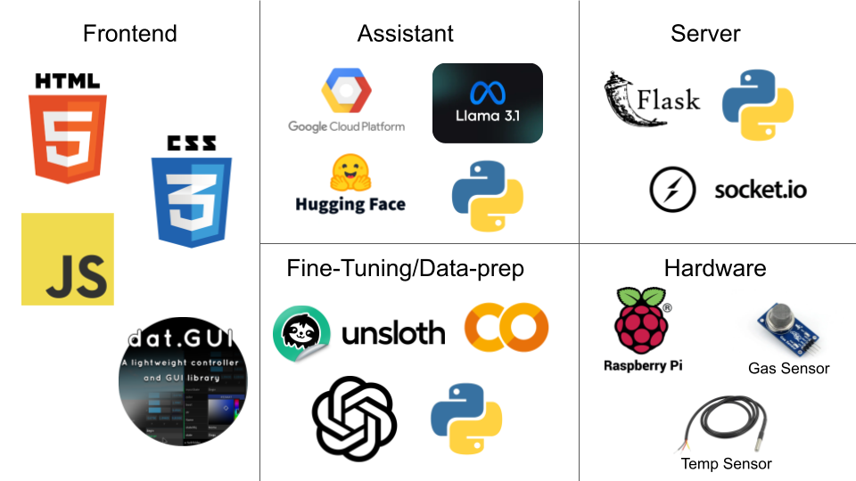

# Cook Buddy

## Motivation
Cooking is hard and recipes are even harder to follow. Help is saving you time and energy, not an article you need to scroll through with your dough covered hands. Hence, Cook-Buddy was born.

## Intro
Cook-Buddy is a friendly, interactive assistant who not only cooks alongside you but adapts recipes to fit whatever ingredients you have on hand. This virtual chef guides you through each step in real time, reading instructions as you go so you can skip the hassle of scrubbing through YouTube tutorials. With built-in sensors like a thermometer and gas detector to ensure accurate, safe cooking even for clueless Waterloo students. Our character is more than just a helper; it’s a cooking buddy. Cracking jokes, teaching new skills, and making cooking a shared and safe experience. Whether you’re a beginner or just looking for a little inspiration, cooking becomes an enjoyable, tasty challenge.

Here's the video demo: https://www.youtube.com/watch?v=q-WvIjfFc7Q&ab_channel=Louie

## Tech Stack

It was a lot to work with, but with good workflows and collaboration, we were able to pull it off.
